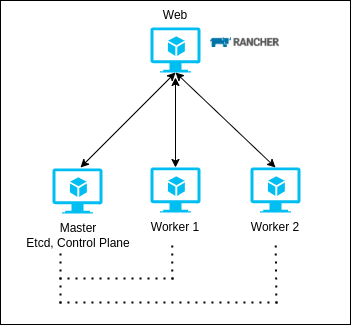
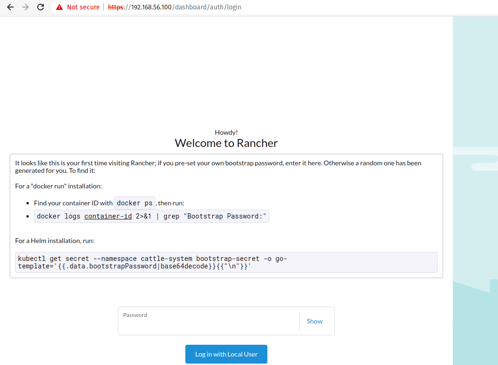
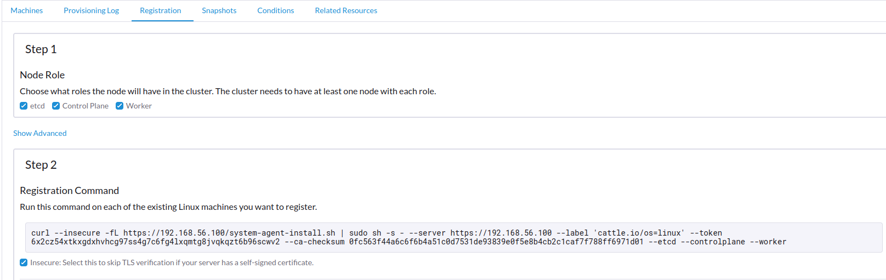

## 💡 Idea
Rancher Kubernetes Engine (RKE) is an open-source container orchestration platform that uses a graphical interface to help manage Kubernetes (k8s).
In this lab, we will create a small test environment with one control plane / etcd and two workers, i.e., this way we will not have high-availability (H.A), with nodes are created automatically through Vagrant.

---

### 🛠️ Worked wuth
* Vagrant
* Docker
* Rancher
* Script Bash

---

### 🚀 Process

1. Create the Vagrantfile on root folder.

2. Create the bootstrap.sh on root folder, that have the instructions no install the dependencies on nodes.

3. Create the bootstrap_web.sh on root folder, that have the instructions no install the Rancher on node Web.

4. After the installed the Docker and Rancher up, you will available to use the Rancher on the navigator, in this case https://192.168.56.100

5. Run the command on node web to receive the password bootstrap to Rancher ``docker logs  container-id  2>&1 | grep "Bootstrap Password:"``

6. Now you will can create the cluster on Rancher using the custom options to create cluster using RKE1/RKE2/k3s.

7. Copy the command on Registration and put on the correspondent nodes:

8. With this, your Cluster will be available to run your projects on Kubernetes (k8s) ;)

---